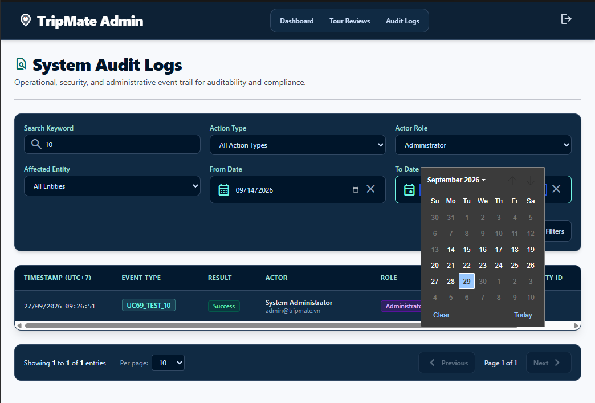
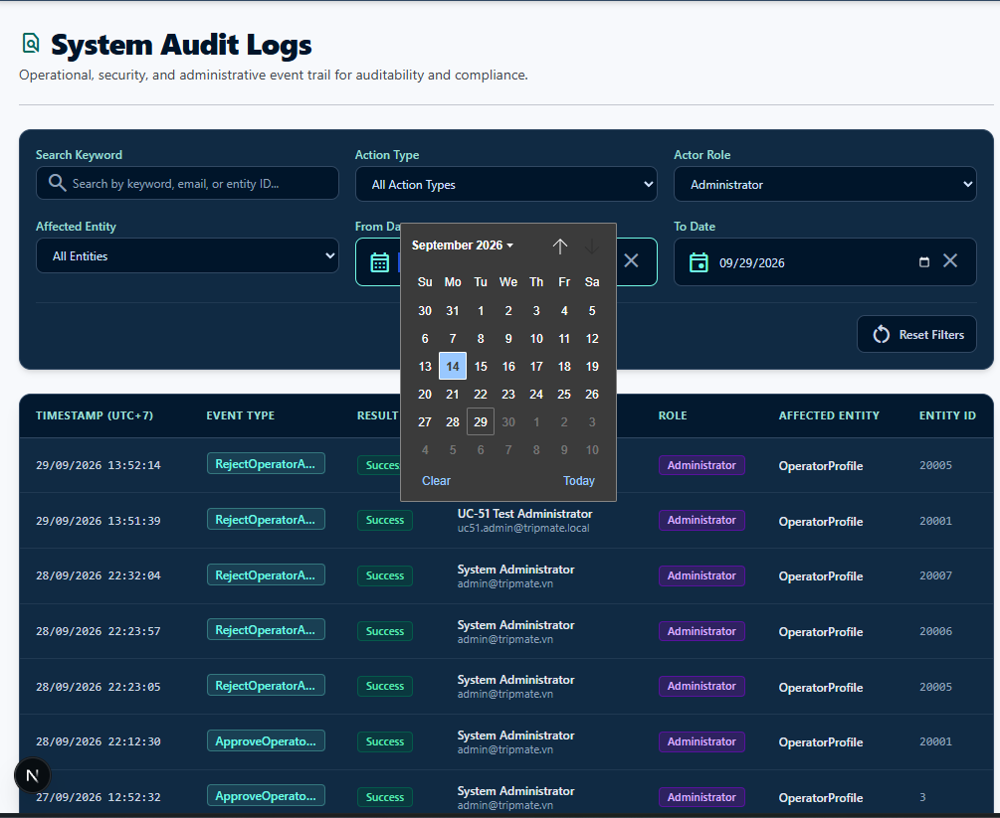
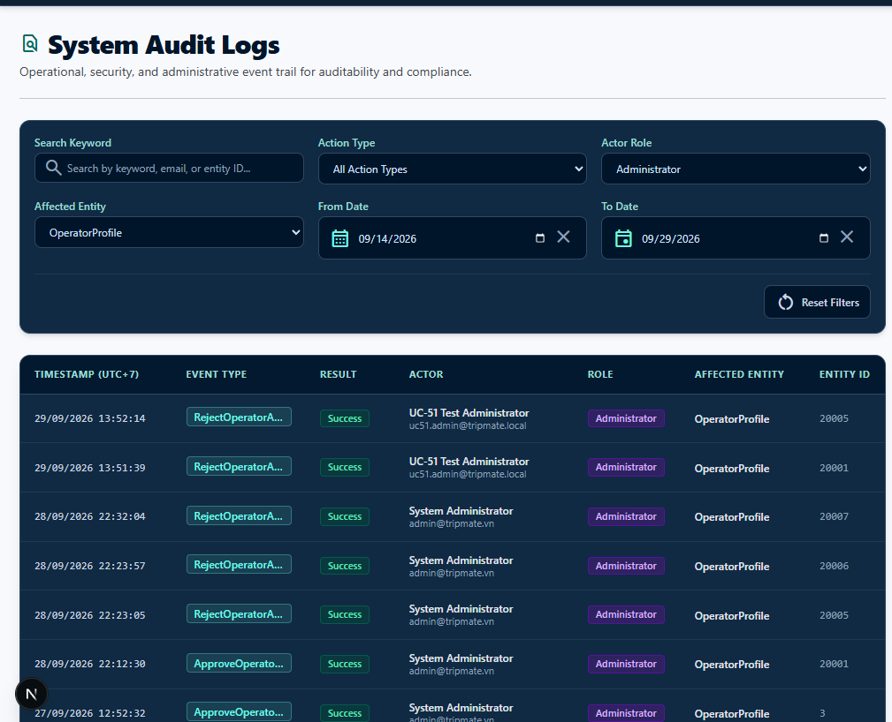

# Implementation Plan — UC-68 Frontend: View Audit Logs

## Overview
This implementation plan outlines the Next.js / TypeScript frontend implementation for **UC-68: View Audit Logs** in `Capstone_FE` (Screen #33 System Audit Logs List).

The feature enables Administrators to view, search, filter, and paginate system audit logs via the `/admin/audit-logs` route.

Status: implementation complete; final-head verification and PR evidence pending.

---

## Technical Context & Decisions

1. **Framework & Styling**: Next.js App Router, TypeScript, TailwindCSS, custom UI components (`ActionButton`, `FeedbackAlert`, `StatusBadge`).
2. **Clean Architecture Separation**:
   - `types/auditLogAdmin.ts`: Data transfer interfaces, `Result`, nullable fields, safe-ID checks, and runtime response guard.
   - `services/auditLogAdminService.ts`: Browser client for the same-origin Admin audit-log proxy, abort support, safe errors, and malformed-success rejection.
   - `api/auditLogProxy.ts`: Server-only boundary that reads the HttpOnly Admin cookie and attaches the Bearer token to the Backend request.
   - `components/`: UI components separated into FilterBar, Table, Pagination, and Main View Container.
   - `app/admin/(console)/audit-logs/page.tsx`: Route entry point.
3. **Route Integration**: Register `ROUTES.admin.auditLogs` in `lib/routes.ts` and add menu link in `AdminNavigation.tsx`.
4. **Timezone & Local Formatting (CR-07)**: Uses `createdAtLocal` formatted string directly from Backend and calculates date-input bounds from the local calendar date before converting selected day boundaries to UTC ISO values.
5. **Authentication Boundary**: The route checks the HttpOnly Admin cookie on the server; the proxy reads that cookie, forwards the Bearer token, and clears invalid sessions on 401/403. Admin login honors only validated local `/admin` return URLs, preventing both the previous hardcoded Create POI redirect and open redirects. No Web-session hook or browser token storage is used.
6. **UC-69 Boundary**: UC-68 displays `Result`; it does not ship a dead View Detail control. UC-69 adds its action together with the working detail surface.

---

## Proposed Component Changes

### Component 1: Application Routes & Navigation
- [MODIFY] [`routes.ts`](file:///d:/study/Project-Capstone/Capstone_FE/src/lib/routes.ts): Add `auditLogs: '/admin/audit-logs'`.
- [MODIFY] [`AdminNavigation.tsx`](file:///d:/study/Project-Capstone/Capstone_FE/src/components/navigation/AdminNavigation.tsx): Add "Audit Logs" navigation link.

### Component 2: Types & API Service Layer
- [NEW] [`auditLogAdmin.ts`](file:///d:/study/Project-Capstone/Capstone_FE/src/features/admin/audit-logs/types/auditLogAdmin.ts): TypeScript interfaces and runtime contract guards (`AuditLogSummaryDto`, `PaginatedList<T>`, `GetAuditLogsParams`).
- [NEW] [`auditLogAdminService.ts`](file:///d:/study/Project-Capstone/Capstone_FE/src/features/admin/audit-logs/services/auditLogAdminService.ts): abortable `getAuditLogs(params, signal)` browser client fetching the same-origin `/api/admin/audit-logs` route and rejecting malformed success payloads.
- [NEW] [`auditLogProxy.ts`](file:///d:/study/Project-Capstone/Capstone_FE/src/features/admin/audit-logs/api/auditLogProxy.ts): forwards approved query parameters to `/api/v1/admin/audit-logs` with the server-held Admin token.

### Component 3: Feature UI Components
- [NEW] [`AuditLogFilterBar.tsx`](file:///d:/study/Project-Capstone/Capstone_FE/src/features/admin/audit-logs/components/AuditLogFilterBar.tsx): Filter & search bar controls.
- [NEW] [`AuditLogTable.tsx`](file:///d:/study/Project-Capstone/Capstone_FE/src/features/admin/audit-logs/components/AuditLogTable.tsx): Responsive horizontal-scroll table with textual Result badges and no inactive UC-69 action.
- [NEW] [`AuditLogPagination.tsx`](file:///d:/study/Project-Capstone/Capstone_FE/src/features/admin/audit-logs/components/AuditLogPagination.tsx): Page & pageSize navigation control.
- [NEW] [`AuditLogManagementView.tsx`](file:///d:/study/Project-Capstone/Capstone_FE/src/features/admin/audit-logs/components/AuditLogManagementView.tsx): Main state container handling loading, error, empty, data, retry, expired-session redirect, cancellation, and stale-response protection.

### Component 4: Next.js Route Page
- [NEW] [`page.tsx`](file:///d:/study/Project-Capstone/Capstone_FE/app/admin/(console)/audit-logs/page.tsx): Server route for `/admin/audit-logs` with the HttpOnly Admin-cookie presence gate.

---

## Verification Plan

### Build & Linting Verification
- `npm run lint`
- `npm run typecheck`
- `npm test`
- `npm run build`
- `git diff --check origin/develop...HEAD`
- Manual Admin login -> direct `/admin/audit-logs` load -> search/filter/date/reset/pagination -> expired-session check.
- Manual 320px and desktop viewport verification, including horizontal table scrolling and keyboard focus.
- Re-run all evidence on the final pushed HEAD and record its SHA plus remote CI in PR #17.

## Working-tree Verification — 2026-09-29

Rebase base: `origin/develop` at `615699c`. The exact pushed feature HEAD and remote CI result are recorded in PR #17 because a commit cannot truthfully embed its own final SHA.

- `npm run lint -- --quiet` — PASS.
- `npm run typecheck` — PASS.
- `npm test` — PASS: 38 Node proxy/session tests and 433 Vitest tests across 44 files.
- UC-68 focused suite — PASS: 17 tests across the protected route, validated Admin-login return URL, management component, and service contract.
- `npm run build` — PASS: 24 routes generated; `/admin/audit-logs` is dynamic because it checks the server-held Admin cookie.
- `git diff --check` — PASS.
- Manual FE -> BE -> SQL list smoke — PASS: Admin HttpOnly-cookie login, direct protected route load, 30 persisted audit rows, Result column, filters, pagination, and real sign-out control rendered correctly.
- Responsive 320px inspection — PASS: document width remained within the viewport (`305px`); the `1100px` audit table scrolled inside its `271px` container without page-level horizontal overflow.

### Manual Test Screenshots

Compact viewport with keyword, role, and date filters:

Desktop audit list with role and date filters:

Desktop audit list filtered by affected entity:

The commands above must be rerun after the rebase commit is finalized. Record the resulting feature HEAD and final-head CI in PR #17 before requesting re-review.
